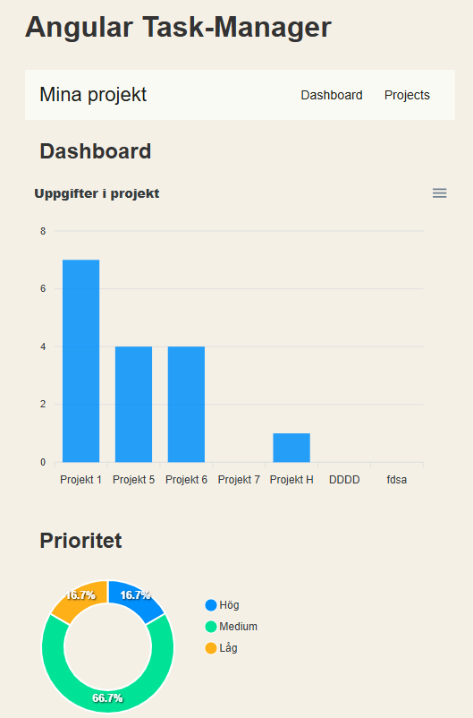

# 🗂️ Task Manager – Angular

https://marcus-task-manager.netlify.app/

En komplett **Task Manager-app** som demonstrerar modern Angular-utveckling helt utan autentisering.  
Alla data lagras lokalt via en **Local-Storage-interceptor**, så ingen extern back-end krävs.

---

# installera beroenden

npm install

# starta dev-server ⇒ http://localhost:4200

npm start # alias: ng serve -o

| Område                | Detaljer                                                                                                         |
| --------------------- | ---------------------------------------------------------------------------------------------------------------- |
| **Projekthantering**  | Lista / skapa / redigera / ta bort • Sök & statusfilter                                                          |
| **Uppgiftshantering** | Lista / skapa / redigera / ta bort • Markera ✔️ klar / 🕓 pågår • Prioritet & deadline • Drag-and-drop-sortering |
| **Dashboard**         | Översikt av antal projekt, uppgifter & % klara                                                                   |
| **Delade byggstenar** | `ShiftDateButtonsComponent`, `OverdueDirective`, `TaskFilterPipe`                                                |
| **Signals**           | `ProjectService` & `TaskService` använder **WritableSignal**; komponenter konsumerar via `toObservable()`        |

| Paket                      | Syfte                        |
| -------------------------- | ---------------------------- |
| **Angular ** (stand-alone) | SPA-ramverket                |
| **Angular Material **      | UI-komponenter               |
| **RxJS + Signals**         | Dataflöden & reaktivt state  |
| **Angular CDK**            | Drag-and-drop-funktionalitet |
| **Karma / Jasmine**        | Enhetstester                 |

Local-Storage-interceptor
Fångar alla HttpClient-anrop mot /projects & /tasks.

Läser/uppdaterar nyckeln localStorage['tm-db'].

Vill du byta till en riktig back-end? – ta bara bort interceptorn.

Reflektion & designval
Signals > RxJS – enklare state, memoiserade selectors.

Local-Storage-back-end – offline-stöd + snabb Netlify-deploy.

Stand-alone-komponenter – minimal boilerplate, explicita imports:.

Strict-typed Reactive Forms – TypeScript garanterar fältens typer.

Custom pipe + direktiv + generisk komponent uppfyller kursens avancerade krav.
